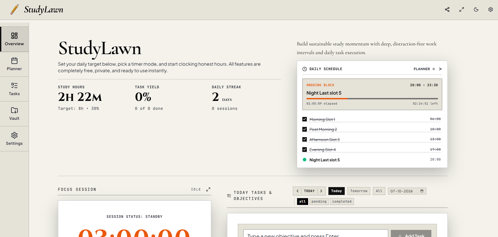
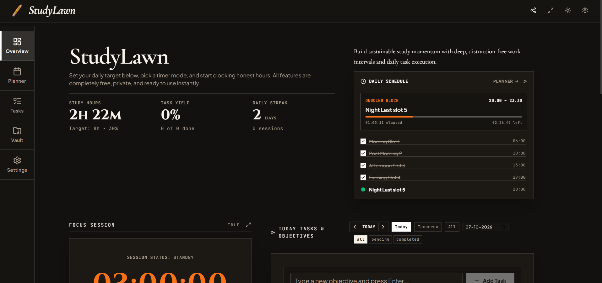

# StudyLawn

<div align="center">
  
  <br />
  <h3>Distraction-Free Daily Study Workspace &amp; Study Hours Tracker</h3>
  <p>
    Clock honest study hours, organize schedules, prioritize tasks, and keep your revision notes in one place.
  </p>

  <p>
    
    
    
    
    
    
  </p>
</div>

---
## 📸 Check out Studylawn

StudyLawn is crafted with meticulous typography and distraction-free editorial themes tailored for prolonged study sessions without eye strain.

### https://studylawn.vercel.app/
Check out Studylawn for instant access to the latest updates.

---

## 📸 Previews

StudyLawn is crafted with meticulous typography and distraction-free editorial themes tailored for prolonged study sessions without eye strain.

### White Paper Theme (Default)


### Dark Theme


---

## 🌟 Core Features

### 1. ⏱️ Study Tracker (Overview Cockpit &amp; Focus Timer)
The central nerve center for tracking honest, focused learning hours.
- **Dual Focus Timer Engines**:
  - **Count-Up Stopwatch**: Track natural study flow without artificial limits.
  - **Countdown Timer**: Structured deep work blocks with quick presets (25m Pomodoro, 45m deep focus, 60m standard, 90m ultradian cycles, or custom duration).
- **Subject &amp; Topic Categorization**: Tag sessions by subject (e.g., Mathematics, Physics, Organic Chemistry, Literature) with live duration breakdowns.
- **Interactive Study Calendar**: Visual chronological record of every study session logged by date, duration, and subject.
- **Floating Popout Timer**: A persistent, draggable mini-timer widget that stays active while you navigate between the Planner, Tasks, and Vault.
- **Dedicated Fullscreen Focus Mode**: Maximize mental immersion with full-screen distraction shields and ambient digital/analog displays.
- **Daily Streak &amp; Target Tracking**: Set your daily study goal (e.g., 6h, 8h, 10h) and track live completion percentage and consistency streaks.

### 2. 📅 Planner Page (Visual Timetable &amp; Schedule Maker)
Transform vague intentions into an executable hourly roadmap.
- **Visual Hourly Time Blocking**: Create defined study slots throughout the day with start and end times, target topics, and completion status.
- **Live Slot Progress Indicator**: Visual progress bar indicating the active running slot, elapsed percentage, and remaining minutes.
- **Slot Templates Library**: Save and load complete daily schedules with a single click (e.g., *Intense Exam Prep*, *Standard College Routine*, *Weekend Revision Drill*).
- **Task Synchronization**: Link syllabus tasks directly to timetable slots so you always know what problem set or chapter to open next.

### 3. ✅ Tasks (Completion Planner &amp; Syllabus Breakdown)
Conquer complex academic syllabi with structured priority lists.
- **Priority-Driven Organization**: Categorize tasks across High, Medium, and Low priorities with clear visual badges.
- **Syllabus Deconstruction**: Break down bulky subjects into manageable units—DPPs, chapter problem sets, previous year questions (PYQs), and lecture packages.
- **Duration Estimations**: Assign estimated completion times to calculate realistic daily workloads.
- **Drag-and-Drop Reordering**: Intuitively sequence tasks in order of daily execution.
- **Progress Tracking**: Instant completion percentages and one-click status toggling.

### 4. 🗄️ Vault (Knowledge Base &amp; Revision Notes)
A lightweight, lightning-fast digital binder for your essential study references.
- **Local File &amp; Folder Explorer**: Organize reference sheets, formula summaries, error logs, and cheat sheets in structured folders.
- **Integrated Note Editor**: Write, edit, and review Markdown and plain-text study notes directly in the app.
- **Document &amp; Image Storage**: Store past year papers, diagram scans, and formula sheets for instant access during study blocks.
- **Quick Search &amp; Filter**: Instantly find notes or documents when working through difficult problem sets.

---

## 🔒 Privacy &amp; Offline First Architecture

- **100% Local-First**: All timers, session history, timetable schedules, tasks, and notes are stored locally in your browser (IndexedDB and localStorage).
- **No Compulsory Accounts**: Open the app and begin studying instantly—no logins, passwords, tracking cookies, or external surveillance.
- **Backup &amp; Restore**: Export your entire workspace into a portable JSON file at any time from Settings, and restore it seamlessly on another browser or machine.

---

## 🛠️ Tech Stack

- **Frontend**: [React 19](https://react.dev/), [TypeScript](https://www.typescriptlang.org/)
- **Build Tool**: [Vite 6](https://vitejs.dev/)
- **Styling**: [Tailwind CSS v4](https://tailwindcss.com/)
- **Icons**: [Lucide React](https://lucide.dev/)
- **Animation**: [Motion](https://motion.dev/)
- **Backend / Dev Server**: [Express](https://expressjs.com/) with Vite middleware for unified local development and static file serving.

---

## 📁 Project Structure

```text
studylawn/
├── public/                 # Static assets, logos, favicon, sitemap
│   ├── dashboard_whitetheme.png
│   ├── dashboard_darktheme.png
│   └── studylawnlogo.png
├── src/
│   ├── components/         # Modular UI components
│   │   ├── OverviewDashboard.tsx    # Study tracker & cockpit
│   │   ├── TimetableTab.tsx         # Daily schedule planner
│   │   ├── CompletionTab.tsx        # Tasks & syllabus breakdown
│   │   ├── TestsTab.tsx             # Vault & notes explorer
│   │   ├── FullscreenTimerPage.tsx  # Distraction-free timer
│   │   ├── PopoutTimer.tsx          # Floating widget timer
│   │   ├── TopHeader.tsx            # Clean navigation bar
│   │   ├── Sidebar.tsx              # Workspace tab switcher
│   │   └── Footer.tsx               # Minimal footer
│   ├── context/            # React state providers (Timer, Theme, Auth)
│   ├── lib/                # Storage utilities & IndexedDB helpers
│   ├── types.ts            # Core TypeScript interfaces
│   ├── App.tsx             # Main routing & layout shell
│   ├── main.tsx            # React application root
│   └── index.css           # Editorial typography & theme variables
├── server.ts               # Express application server
├── vite.config.ts          # Vite build configuration
├── tsconfig.json           # TypeScript configuration
└── package.json            # Project dependencies & scripts
```

---

## 🚀 Getting Started

Follow these steps to run StudyLawn locally on your computer.

### Prerequisites

- [Node.js](https://nodejs.org/) (version 18.0.0 or higher recommended)
- `npm`, `pnpm`, or `bun`

### 1. Clone the Repository

```bash
git clone https://github.com/aaravwritess/studylawn.git
cd studylawn
```

### 2. Install Dependencies

Using npm:
```bash
npm install
```

Or using bun:
```bash
bun install
```

### 3. Start the Development Server

```bash
npm run dev
```

Open your browser and navigate to:
```text
http://localhost:3000
```

### 4. Build for Production

To create an optimized production build:
```bash
npm run build
```

To run the production server:
```bash
npm start
```

### 5. Type Checking / Linting

Verify TypeScript types across the codebase:
```bash
npm run lint
```

---

## 📄 License

This project is open-source and available under the [MIT License](LICENSE).
Feel free to fork, customize, and build upon it!
